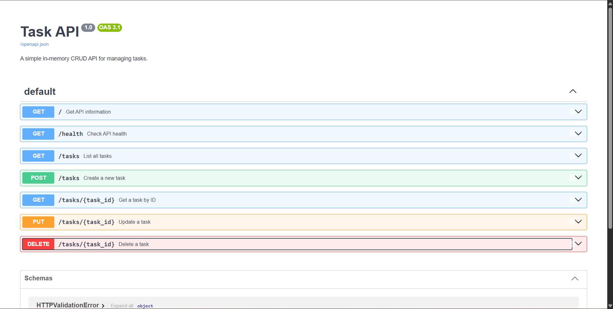

# Task API

A simple **FastAPI CRUD API** for managing a to-do list using an in-memory list.

The project implements the four main CRUD operations:


* **Create** tasks
* **Read** tasks
* **Update** tasks
* **Delete** tasks

It also includes automatic **Swagger UI** documentation through FastAPI.



## Features

* FastAPI backend
* In-memory task storage
* Full CRUD operations
* Input validation
* Correct HTTP status codes
* JSON responses
* Health-check endpoint
* Interactive Swagger UI
* Git/GitHub version control

## Requirements

* Python 3.10+
* pip
* Git

## Installation

Clone the repository:

```bash
git clone <YOUR_GITHUB_REPOSITORY_URL>
cd CraudAPI
```

Create a virtual environment:

### Windows PowerShell

```powershell
python -m venv venv
venv\Scripts\Activate.ps1
```

Install the dependencies:

```powershell
pip install -r requirements.txt
```

## Running the API

Start the server with:

```powershell
uvicorn main:app --reload --port 8000
```

The API will be available at:

```text
http://localhost:8000
```

Swagger UI is available at:

```text
http://localhost:8000/docs
```

## API Endpoints

| Method | Endpoint      | Description         | Success |
| ------ | ------------- | ------------------- | ------- |
| GET    | `/`           | Get API information | 200     |
| GET    | `/health`     | Check API health    | 200     |
| GET    | `/tasks`      | Get all tasks       | 200     |
| GET    | `/tasks/{id}` | Get one task        | 200     |
| POST   | `/tasks`      | Create a task       | 201     |
| PUT    | `/tasks/{id}` | Update a task       | 200     |
| DELETE | `/tasks/{id}` | Delete a task       | 204     |

## Task Structure

Each task contains:

```json
{
  "id": 1,
  "title": "Learn FastAPI",
  "done": false
}
```

When creating a task, only the title is required:

```json
{
  "title": "Buy milk"
}
```

The API automatically assigns the next available ID and sets `done` to `false`.

## CRUD Examples

### Get all tasks

```powershell
curl.exe -i http://localhost:8000/tasks
```

Example response:

```text
HTTP/1.1 200 OK
```

```json
[
  {
    "id": 1,
    "title": "Learn FastAPI",
    "done": false
  },
  {
    "id": 2,
    "title": "Build CRUD API",
    "done": false
  }
]
```

### Get one task

```powershell
curl.exe -i http://localhost:8000/tasks/1
```

### Create a task

```powershell
Invoke-RestMethod -Uri "http://localhost:8000/tasks" -Method POST -ContentType "application/json" -Body '{"title":"Buy milk"}'
```

The server returns:

```text
HTTP/1.1 201 Created
```

### Update a task

```powershell
curl.exe -i -X PUT http://localhost:8000/tasks/1 -H "Content-Type: application/json" -d "{\"title\":\"Learn FastAPI properly\",\"done\":true}"
```

### Delete a task

```powershell
curl.exe -i -X DELETE http://localhost:8000/tasks/1
```

The server returns:

```text
HTTP/1.1 204 No Content
```

## Validation and Error Handling

The API validates incoming data and returns appropriate HTTP status codes.

| Situation            | Status |
| -------------------- | -----: |
| Successful GET       |    200 |
| Successful POST      |    201 |
| Successful PUT       |    200 |
| Successful DELETE    |    204 |
| Invalid request body |    400 |
| Task does not exist  |    404 |

For example, an empty title is rejected:

```powershell
curl.exe -i -X POST http://localhost:8000/tasks -H "Content-Type: application/json" -d "{\"title\":\"   \"}"
```

The API returns a `400 Bad Request` response.

Trying to access a nonexistent task also returns `404 Not Found`:

```powershell
curl.exe -i http://localhost:8000/tasks/99
```

## Swagger UI

FastAPI automatically generates interactive API documentation.

Open:

```text
http://localhost:8000/docs
```

From Swagger UI, all CRUD operations can be tested using the **Try it out** button.

### Swagger Screenshot


> Place your Swagger screenshot in the project root and name it `swagger.png`, or change the filename above to match your screenshot.

## In-Memory Storage

This project intentionally does **not** use a database or files.

Tasks are stored in a Python list while the server is running.

This means that restarting the server resets the task list to the three initial example tasks.

This behavior is intentional because database persistence is outside the scope of this assignment.

## Project Structure

```text
CraudAPI/
├── main.py
├── requirements.txt
├── README.md
├── .gitignore
└── swagger.png
```

## Technologies

* Python
* FastAPI
* Uvicorn
* Pydantic
* Git
* GitHub

## Author

Nayef Nagib
